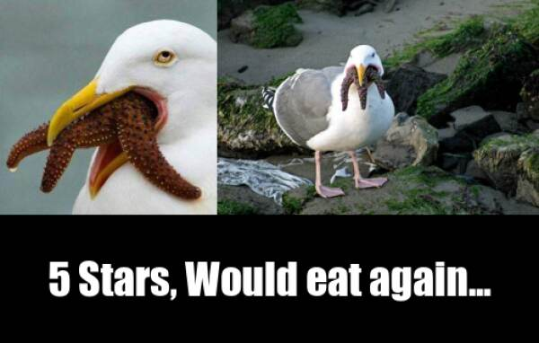
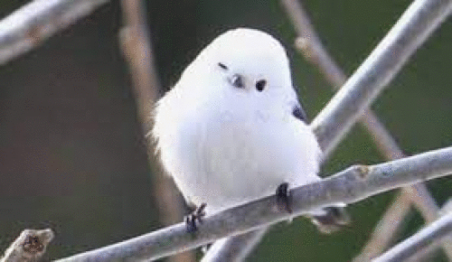

### youmin kim, ykim753, Stats 220 Project 1 Part D
```{r setup, include=FALSE}
knitr::opts_chunk$set(echo = TRUE)
```

## My meme
This meme was created for the purpose to pass stats 220 project 1 and since I've never knew that seagulls eats starfish. Quote inspired by a Reddit post comment. 


```{r file='meme.R', eval=FALSE}
#youmin kim, ykim753, Stats 220 Project 1 Part B
library(magick)
library(tidyverse)

seagull <- image_read("seagulleatsstarfish_closeup.jpg") %>%
  image_scale(203)

seagull2 <- image_read("seagulleatsstarfish2.jpg") %>%
  image_scale(301)

starstext <- image_blank(width = 504,
                         height = 120,
                         color = "#000000") %>%
  image_annotate(text = "5 Stars, Would eat again...",
                 color = "#ffffff",
                 size = 40,
                 font = "Impact",
                 gravity = "center")

top_birds <- image_append(c(seagull, seagull2))
bottom_text <- image_append(c(starstext))

whole_img <- c(top_birds, bottom_text) %>%
  image_append(stack = TRUE) %>%
  image_scale(600) #here to scale everything in meme

#whole_img
image_write(whole_img, "seagullyumyum.png")

```

## My animated GIF
This gif was created for the purpose to pass stats 220 project 1. Just a cute white Aegithalos caudatus.

```{r file='animation.R', eval=FALSE}
#youmin kim, ykim753, Stats 220 Project 1 Part C
library(magick)
#babs.jpg in stats220 folder
frame1 <- image_read("bab1.jpg") %>% image_scale(500)
frame2 <- image_read("bab2.jpg") %>% image_scale(333)
frame3 <- image_read("bab3.jpg") %>% image_scale(304)
frame4 <- image_read("bab4.jpg") %>% image_scale(300)
frame5 <- image_read("bab5.jpg") %>% image_scale(333)

frames <- c(frame1, frame5, frame3, frame4, frame2)

wholegif <- frames %>%
  image_animate(fps = 1)
#wholegif
image_write(wholegif, "babbird.gif")

```

```{css}
<style>


h1 {
  font-family: Arial, sans-serif;
  color: #ecf14b;
  background-color: #000000;
}

h2 {
  font-size: 36px;
  font-family: "Comic Sans MS", "Comic Sans", cursive;
  color: #f5f7bc;
  background-color: #000000;
  font-weight: bold;
}

p{
  padding: 24px;
  font-family: "Comic Sans MS", "Comic Sans", cursive;
  color: #FFFFFF;
  background-color: #000000;
  font-weight: bold;
}

</style>

```

